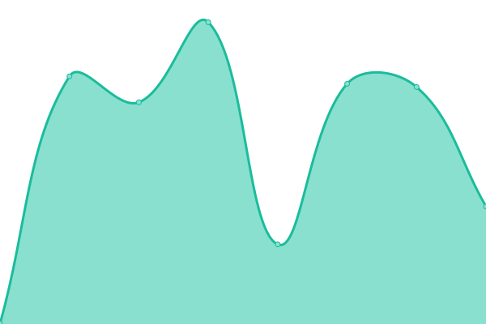
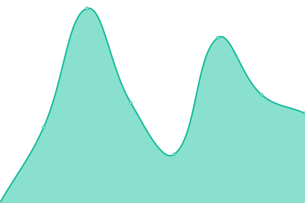

# [📈 Live Status](https://tochimoreno.github.io/upptime): <!--live status--> **🟩 All systems operational**

This repository contains the open-source uptime monitor and status page for [Tochi](tochi.com.ar), powered by [Upptime](https://github.com/upptime/upptime).

With [Upptime](https://upptime.js.org), you can get your own unlimited and free uptime monitor and status page, powered entirely by a GitHub repository. We use [Issues](https://github.com/tochimoreno/upptime/issues) as incident reports, [Actions](https://github.com/tochimoreno/upptime/actions) as uptime monitors, and [Pages](https://tochimoreno.github.io/upptime) for the status page.

<!--start: status pages-->
<!-- This summary is generated by Upptime (https://github.com/upptime/upptime) -->
<!-- Do not edit this manually, your changes will be overwritten -->
<!-- prettier-ignore -->
| URL | Status | History | Response Time | Uptime |
| --- | ------ | ------- | ------------- | ------ |
|  [Luxis](https://luxis.com.ar/) | 🟩 Up | [luxis.yml](https://github.com/tochimoreno/upptime/commits/HEAD/history/luxis.yml) | 

 934ms
     
 | 

<a href="https://tochimoreno.github.io/upptime/history/luxis">100.00%</a>
    

|  [Luxis Srv](https://ls.tochisaurio.com.ar) | 🟩 Up | [luxis-srv.yml](https://github.com/tochimoreno/upptime/commits/HEAD/history/luxis-srv.yml) | 

 414ms
     
 | 

<a href="https://tochimoreno.github.io/upptime/history/luxis-srv">100.00%</a>
    

|  [No Me Olvides](https://nomeolvidescrochet.com.ar) | 🟩 Up | [no-me-olvides.yml](https://github.com/tochimoreno/upptime/commits/HEAD/history/no-me-olvides.yml) | 

 2087ms
     
 | 

<a href="https://tochimoreno.github.io/upptime/history/no-me-olvides">100.00%</a>
    

|  [TochiMoreno](https://tochimoreno.com.ar) | 🟩 Up | [tochi-moreno.yml](https://github.com/tochimoreno/upptime/commits/HEAD/history/tochi-moreno.yml) | 

 1441ms
     
 | 

<a href="https://tochimoreno.github.io/upptime/history/tochi-moreno">100.00%</a>
    

|  [Tochi](https://tochi.com.ar) | 🟩 Up | [tochi.yml](https://github.com/tochimoreno/upptime/commits/HEAD/history/tochi.yml) | 

 279ms
     
 | 

<a href="https://tochimoreno.github.io/upptime/history/tochi">100.00%</a>
    

|  [Tochisaurio](https://tochisaurio.com.ar) | 🟩 Up | [tochisaurio.yml](https://github.com/tochimoreno/upptime/commits/HEAD/history/tochisaurio.yml) | 

 283ms
     
 | 

<a href="https://tochimoreno.github.io/upptime/history/tochisaurio">100.00%</a>
    

<!--end: status pages-->

[**Visit our status website →**](https://tochimoreno.github.io/upptime)

## 📄 License

- Powered by: [Upptime](https://github.com/upptime/upptime)
- Code: [MIT](./LICENSE) © [Tochi](tochi.com.ar)
- Data in the `./history` directory: [Open Database License](https://opendatacommons.org/licenses/odbl/1-0/)
